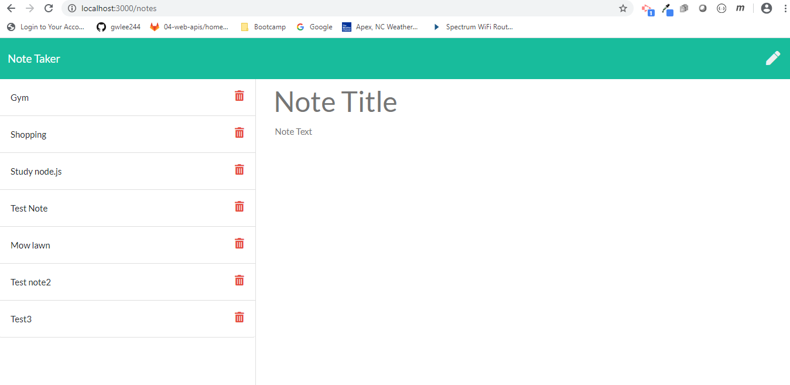

# Unit 11 Express Homework: Note Taker

The purpose of this homework assignment was to build a CLI app that uses an express backend and saves and retrieves note data from a JSON file.

Criteria for a successful program:
* Application should allow users to create and save notes.
* Application should allow users to view previously saved notes.
* Application should allow users to delete previously saved notes.

```
As a manager
AS A user, I want to be able to write and save notes
I WANT to be able to delete notes I've written before
SO THAT I can organize my thoughts and keep track of tasks I need to complete
```
### Development 
Steps taken to create the program:
1. Copied initial base files (provided)
2. npm init
3. npm install (express and fs)
4. Created separate files for HTML and API routes

## Testing

n/a

## Built With

* [VSCode](https://code.visualstudio.com/) - The platform used for developing this project.
* [MDN](https://developer.mozilla.org/en-US/) - Used for reference.
* [NodePackageManager](https://www.npmjs.com/) - Used to install node modules/dependencies
* [Express](https://www.npmjs.com/package/express) - A collection of common interactive command line user interfaces.

## Authors

* **Gene Lee** - [gwlee244](https://github.com/gwlee244)

## License

* ISC

## Acknowledgments

* The instructor, TAs, and classmates at the Coding Bootcamp at UNC


